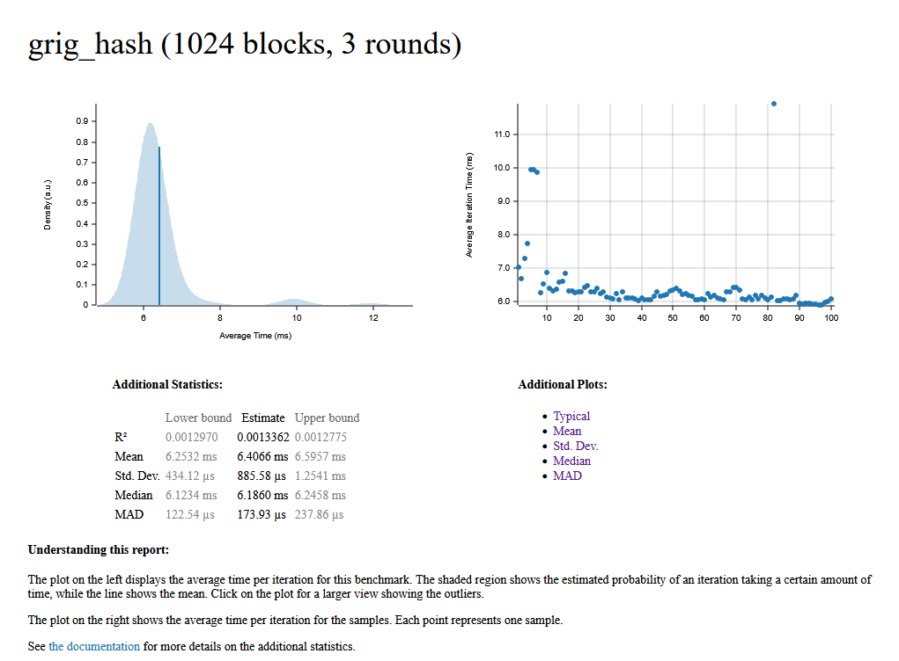
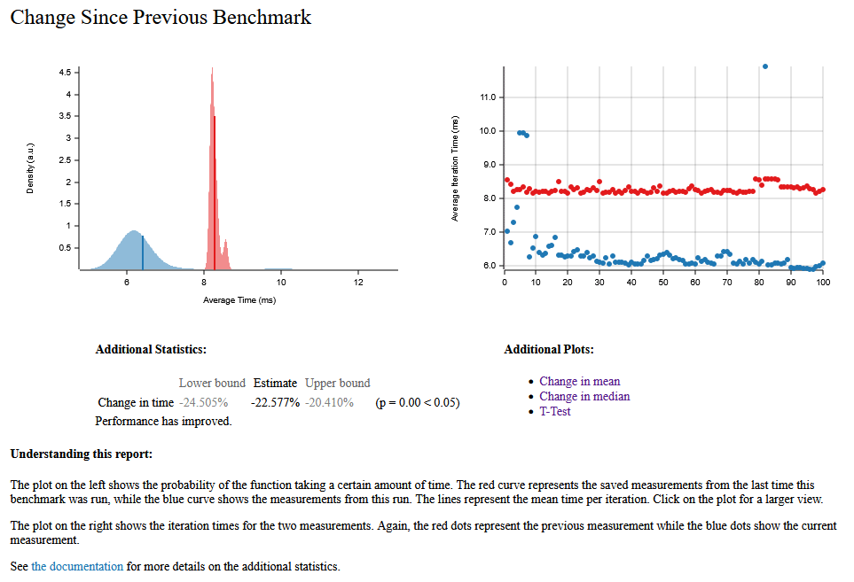

# Grig (Research Prototype)

⚠️ **WARNING:**  
This is a research prototype and MUST NOT be used in production systems.  
It has NOT been cryptographically reviewed, formally analyzed, or tested against real attackers.

---

## Overview

Grig is an experimental framework for a next-generation **memory-hard function (MHF)** designed for password hashing.

It explores a novel direction:
- Dynamic, state-dependent memory graphs
- Hidden logical dependencies
- Reduced observable memory access leakage

Modern designs like Argon2id provide strong security, but a fundamental tension remains:

> Data-dependent access (strong hardness) vs. data-independent access (side-channel safety)

Grig attempts to partially decouple these properties.

---

## Threat Model

Grig assumes an adversary with:

- Full knowledge of the algorithm
- Ability to perform offline password guessing
- Access to GPU / ASIC acceleration
- Capability to observe memory access patterns (side-channel attacker)

Out of scope:

- Physical attacks
- Fault injection
- Microarchitectural exploits (e.g. speculative execution)

---

## Design Goals

- Strong memory hardness
- Dynamic dependency evolution
- Reduced observable leakage
- Resistance to GPU / ASIC optimizations
- Mitigation of time-memory tradeoffs (TMTO)

---

## Architecture

The computation is modeled as a dynamic directed graph:

G = (V, E)

Where:
- V = memory blocks
- E = cryptographic dependencies

Graph evolution:

G(t+1) = F(G(t), S(t))

---

## Core Components

- **Memory Block** – Fixed-size memory unit
- **State** – Internal evolving cryptographic state
- **Graph** – Generates dynamic dependencies
- **Mixer** – Combines parent blocks + state
- **Permutation Layer** – Obfuscates observable memory access patterns

---

## Algorithm (Simplified)

S0 = H(password || salt || params)

for t in rounds:
parents = Graph.select(S_t)
block = Mixer(parents, S_t)
memory[i] = block
S_t+1 = update(S_t, block)

output = Finalize(S)

## Key Idea

Grig separates:

- Logical dependency graph (hidden)
- Physical memory access pattern (observable)

Goal:

> Preserve memory hardness while reducing leakage from access patterns

---

## Comparison

| Property | Argon2id | Grig |
|--------|--------|------|
| Memory-hard | ✅ | ✅ |
| Data-dependent | Partial | Dynamic |
| Side-channel resistance | Medium | Targeted |
| Graph evolution | Static | Dynamic |

## Performance Benchmarks

The `grig_hash` function has been benchmarked with 1024 blocks and 3 rounds.

### Current Metrics

| Metric | Estimate | Interval (Lower / Upper Bound) |
| :--- | :--- | :--- |
| **Mean** | 6.4066 ms | 6.2532 ms / 6.5957 ms |
| **Median** | 6.1860 ms | 6.1234 ms / 6.2458 ms |
| **Std. Dev.** | 885.58 µs | 434.12 µs / 1.2541 ms |

### Comparison to Previous Run

🚀 **Performance has improved significantly!** 
The current run shows a performance improvement of **-22.577%** ($p = 0.00 < 0.05$) compared to the previous benchmark. 

*Benchmarks were generated using [Criterion.rs](https://github.com/bheisler/criterion.rs).*

---

## Repository Structure
grig/
├── grig-core/ # Core Rust hashing implementation
├── benchmarks/ # Performance evaluation (planned)
├── tests/ # Test suite (planned)
└── documentation/ # Specs, research drafts

---

## Implementation

- Language: Rust
- Goal: Safety + performance
- Future: Potential low-level optimization in C

---

## Status

🚧 Early-stage research prototype  
🧪 Not security-audited  
📚 Intended for experimentation and exploration

---

## License

MIT